# Legal hypergraphs: the paper workflow in honets

Coupette, Hartung and Katz (2024) model legal relations as temporal
hypergraphs: a citation block binds every decision it cites to the
decision that cites them, and a tribunal binds its three arbitrators for
as long as the case runs. The paper works through two datasets, the
citation blocks of the German Federal Constitutional Court (GFCC) and
the tribunals of the International Centre for Settlement of Investment
Disputes (ICSID), and applies three families of methods to them:
hyperedge centralities, motifs against a configuration null, and
communities of a weighted projection. This vignette reproduces that
workflow in honets on the authors’ released data, figure by figure.
Hypergraph construction and mathematics are native to honets; once a
projection is an ordinary graph, cograph supplies the graph algorithms
and the drawing.

## Data

Both datasets ship with honets, rebuilt from the authors’ Zenodo archive
(record 8081507, CC BY-NC 4.0) by `data-raw/legal_hypergraphs.R`.
`icsid_tribunals` has one row per tribunal seat: the case, the
arbitrator who held the seat, the dates on which the tribunal was
constituted and the case concluded, and the case metadata. A pending
case has no conclusion date.

``` r

head(icsid_tribunals)
#>       case         seat             arbitrator registered constituted
#> 1 ARB/74/1 arbitrator_1 Jacques Michel GROSSEN 1974-03-06  1974-10-07
#> 2 ARB/74/1 arbitrator_2       Dominique PONCET 1974-03-06  1974-10-07
#> 3 ARB/74/1    president           Pierre CAVIN 1974-03-06  1974-10-07
#> 4 ARB/74/2 arbitrator_1           Michael KERR 1974-06-21  1974-12-16
#> 5 ARB/74/2 arbitrator_2           Fuad ROUHANI 1974-06-21  1974-12-16
#> 6 ARB/74/2    president          Jørgen TROLLE 1974-06-21  1974-12-16
#>    concluded is_concluded   economic_sector                           subject
#> 1 1977-08-29         TRUE    Other Industry Production of fibers and textiles
#> 2 1977-08-29         TRUE    Other Industry Production of fibers and textiles
#> 3 1977-08-29         TRUE    Other Industry Production of fibers and textiles
#> 4 1977-02-27         TRUE Oil, Gas & Mining                    Bauxite mining
#> 5 1977-02-27         TRUE Oil, Gas & Mining                    Bauxite mining
#> 6 1977-02-27         TRUE Oil, Gas & Mining                    Bauxite mining
#>      respondent
#> 1 Côte d'Ivoire
#> 2 Côte d'Ivoire
#> 3 Côte d'Ivoire
#> 4       Jamaica
#> 5       Jamaica
#> 6       Jamaica
```

`gfcc_decisions` has one row per decision with its date, and
`gfcc_citations` one row per citation: the citing decision, the cited
decision, the citation block the citation belongs to, and the dates of
both decisions.

``` r

head(gfcc_decisions)
#>   decision       date        citation      type
#> 1  001-001 1951-09-09  BVerfGE 1, 1-3 Beschluss
#> 2  001-003 1951-09-27    BVerfGE 1, 3 Beschluss
#> 3  001-004 1951-09-27  BVerfGE 1, 4-5 Beschluss
#> 4  001-005 1951-09-27  BVerfGE 1, 5-7 Beschluss
#> 5  001-007 1951-10-03  BVerfGE 1, 7-8 Beschluss
#> 6  001-009 1951-10-11 BVerfGE 1, 9-10 Beschluss
#>                                                                                                                                                                                       title
#> 1 Neugliederung im Gebiet der Länder Baden, Württemberg-Baden und Württemberg-Hohenzollern gemäß Art. 118 GG ("Südweststaat" ): Aussetzung der Volksabstimmung durch einstweilige Anordnung
#> 2                                                                                                           Keine Geltendmachung von Schadensersatzansprüchen mittels Verfassungsbeschwerde
#> 3                                                                                                Voraussetzungen der Verfassungsbeschwerde gegen rechtskräftige gerichtliche Entscheidungen
#> 4                                                                                         Keine Verfassungsbeschwerde gegen auf Grund der Entnazifizierungsgesetze ergangene Entscheidungen
#> 5                                                                  Verfassungsbeschwerde gegen rechtskräftige Entscheidungen ordentlicher Gerichte: Umfang der Überprüfung durch das BVerfG
#> 6                                                                   Keine Verfassungsbeschwerde gegen nichtbeschwerdefähige gerichtliche Entscheidungen, die der Urteilsfällung vorausgehen
head(gfcc_citations)
#>    citing   cited       block date_citing date_cited
#> 1 001-001 001-014 001-001:000  1951-09-09 1951-10-23
#> 2 001-005 001-004 001-005:000  1951-09-27 1951-09-27
#> 3 001-066 001-014 001-066:000  1951-10-02 1951-10-23
#> 4 001-074 001-322 001-074:000  1951-11-13 1952-05-28
#> 5 001-085 001-117 001-085:000  1951-11-27 1952-02-20
#> 6 001-202 001-184 001-202:000  1952-03-20 1952-03-20
```

## Models

[`temporal_hypergraph()`](https://mohsaqr.github.io/hypernets/reference/temporal_hypergraph.md)
reads co-presence data the way Dynet does: `actor` names the node column
and `group` the column whose shared value binds actors into one
hyperedge, here the case. `start` and `end` give the interval on which
the hyperedge is active, the paper’s interval-event model. The dates
become days since the first constitution, the unit and origin the object
reports. A case without a conclusion date stays active through the end
of observation, which the paper sets at its cut-off, 2023-06-15;
`observation_end` declares that window without rewriting the data. Every
other column that is constant within a case, such as the economic
sector, is kept as an attribute of the hyperedge; the seat, which varies
within a case, is not.

``` r

tribunals <- temporal_hypergraph(
  icsid_tribunals, actor = "arbitrator", group = "case",
  start = "constituted", end = "concluded",
  observation_end = as.Date("2023-06-15")
)
tribunals
#> Temporal hypergraph: 441 nodes, 742 hyperedges, 1076 event times
#> Format: interval (a hyperedge is active from its start to its end)
#> Time: days since 1974-10-07; observed from 0 to 17783 (declared)
summary(tribunals)
#>   n_nodes n_hyperedges n_event_times first_time last_time n_memberships
#> 1     441          742          1076          0     17782          2226
#>   mean_edge_size median_edge_size mean_duration   format time_unit
#> 1              3                3      1303.436 interval      days
```

The citation table is the same shape: the cited decision is the actor
and the citation block the group. A block has a single `time`, the date
of the decision that contains it, so it is a contact hyperedge: an
instantaneous event, as in a contact log. The paper’s point-aggregation
model, in which a block stays in the network once it has appeared, is
not a property of the data but a way of looking at it, and it is asked
for below with `mode = "cumulative"`. The citing decision is constant
within a block, so `citing` becomes the block’s attribute. The decision
table is the node universe, so that a decision exists from its own date
whether or not it has been cited. `sparse = TRUE` stores the 46,257 by
3,618 incidence as a sparse matrix.

``` r

blocks <- temporal_hypergraph(
  gfcc_citations, actor = "cited", group = "block", time = "date_citing",
  nodes = gfcc_decisions, sparse = TRUE
)
blocks
#> Temporal hypergraph: 3618 nodes, 46257 hyperedges, 2026 event times
#> Format: contact (a hyperedge is an instantaneous event; mode = "cumulative" keeps every hyperedge once it appears)
#> Time: days since 1951-09-09; observed from 0 to 25762
summary(blocks)
#>   n_nodes n_hyperedges n_event_times first_time last_time n_memberships
#> 1    3618        46257          2026          0     25762         77284
#>   mean_edge_size median_edge_size mean_duration  format time_unit
#> 1       1.670753                1            NA contact      days
```

The two summaries are the paper’s Table 1: 742 cases with 441
arbitrators and 2,226 memberships, and 46,257 citation blocks with
77,284 memberships over 2,026 decision dates between 1951 and 2022. The
paper counts 1,077 event times for ICSID because it adds its cut-off
date as the end of every pending case; here those cases have no end.

### Four representations of the same data

[`hypergraph_snapshot()`](https://mohsaqr.github.io/hypernets/reference/hypergraph_snapshot.md)
with `mode = "cumulative"` and no `at` returns the static aggregate of a
temporal hypergraph, every hyperedge begun by the end of observation, as
a `net_hypergraph` that every static verb accepts.

``` r

tribunals_all <- hypergraph_snapshot(tribunals, mode = "cumulative")
tribunals_all
#> Hypergraph: 441 nodes, 742 hyperedges
#> Size distribution:
#>   size_3   : 742
#> Source: group membership (member = member, group = edge)
blocks_all <- hypergraph_snapshot(blocks, mode = "cumulative")
blocks_all
#> Hypergraph: 3618 nodes, 46257 hyperedges
#> Size distribution:
#>   size_1   : 30887
#>   size_2   : 7759
#>   size_3   : 3787
#>   size_4   : 1880
#>   size_5   : 922
#>   size_6   : 513
#>   size_7   : 220
#>   size_8   : 130
#>   size_9   : 61
#>   size_10  : 35
#>   size_11  : 26
#>   size_12  : 12
#>   size_13  : 6
#>   size_14  : 5
#>   size_15  : 2
#>   size_16  : 3
#>   size_17  : 3
#>   size_18  : 3
#>   size_19  : 2
#>   size_27  : 1
#> Source: group membership (member = member, group = edge)
```

[`hg_representations()`](https://mohsaqr.github.io/hypernets/reference/hg_representations.md)
reports an aggregate the four ways the paper’s Table 2 reads it: the
multi-hypergraph as it is (`mh`), the binary hypergraph of distinct
member sets (`bh`), and the graph the hypergraph reduces to, with (`mg`)
or without (`bg`) edge multiplicities. For the tribunals the graph is
the clique expansion, in which every pair of members of a tribunal is an
edge.

``` r

hg_representations(tribunals_all)
#>   representation       type n_nodes n_edges mean_degree median_degree
#> 1             bg      graph     441    1869    8.476190             4
#> 2             mg      graph     441    2226   10.095238             4
#> 3             bh hypergraph     441     722    4.911565             2
#> 4             mh hypergraph     441     742    5.047619             2
```

For the citation blocks the graph is the citation graph, in which the
citing decision is joined to every decision in the block;
`graph = "citation"` selects it and `edge_source` names the attribute
that holds the citing decision. The multi-graph has five edges fewer
than the paper’s 77,284 because five citations repeat a target inside
one block, which a graph edge list can hold and a hypergraph incidence
cannot, and the binary hypergraph has two member sets fewer for the same
reason.

``` r

hg_representations(blocks_all, graph = "citation", edge_source = "citing")
#>   representation       type n_nodes n_edges mean_degree median_degree
#> 1             bg      graph    3618   39428    10.89773            15
#> 2             mg      graph    3618   77279    21.35959            22
#> 3             bh hypergraph    3618   13539    10.15285             6
#> 4             mh hypergraph    3618   46257    21.35959            10
#>   median_out_degree median_in_degree
#> 1                 6                7
#> 2                 9               10
#> 3                NA               NA
#> 4                NA               NA
```

The representation changes what a node looks like: a decision has a
median of 6 outgoing citations as a graph node and is a member of a
median of 10 blocks as a hypergraph node, and an arbitrator has a median
of 4 colleagues but sits on a median of 2 tribunals.

### Decisions as hypergraphs

[`hg_subset()`](https://mohsaqr.github.io/hypernets/reference/hg_subset.md)
with `where =` keeps the hyperedges whose attribute takes a value, here
the blocks of one citing decision: the hypergraph that a single decision
is in this model. The decision 153-001 is the headscarf ban; its 68
citation blocks bind 85 cited decisions, 28 of them cited alone.

``` r

headscarf <- hg_subset(blocks_all, where = c(citing = "153-001"))
headscarf
#> Hypergraph: 85 nodes, 68 hyperedges
#> Size distribution:
#>   size_1   : 28
#>   size_2   : 16
#>   size_3   : 9
#>   size_4   : 7
#>   size_5   : 2
#>   size_6   : 3
#>   size_7   : 1
#>   size_8   : 1
#>   size_12  : 1
#> Source: group membership (member = member, group = edge)
```

[`plot()`](https://rdrr.io/r/graphics/plot.default.html) places the
cited decisions with a spring layout of the clique projection and draws
every block as a blob around its members, coloured by cardinality: the
paper’s Figure 3. A decision cited alone is drawn as its node.

``` r

plot(headscarf, color_by = "size", labels = FALSE, padding = 0.035,
     legend_title = "block size")
```

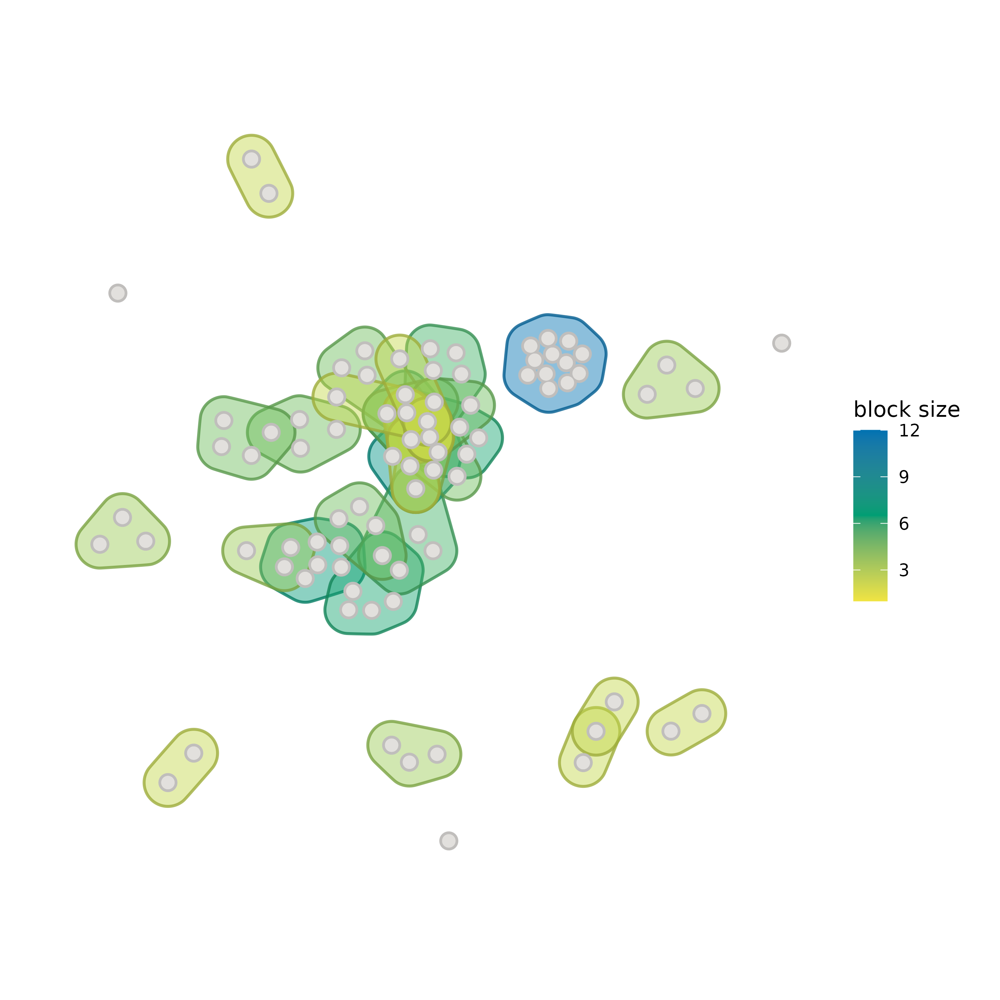

The decision 125-260 on data retention has the same structure with
larger blocks.

``` r

retention <- hg_subset(blocks_all, where = c(citing = "125-260"))
retention
#> Hypergraph: 56 nodes, 100 hyperedges
#> Size distribution:
#>   size_1   : 61
#>   size_2   : 15
#>   size_3   : 14
#>   size_4   : 8
#>   size_6   : 1
#>   size_7   : 1
#> Source: group membership (member = member, group = edge)
plot(retention, color_by = "size", labels = FALSE, padding = 0.035,
     legend_title = "block size")
```

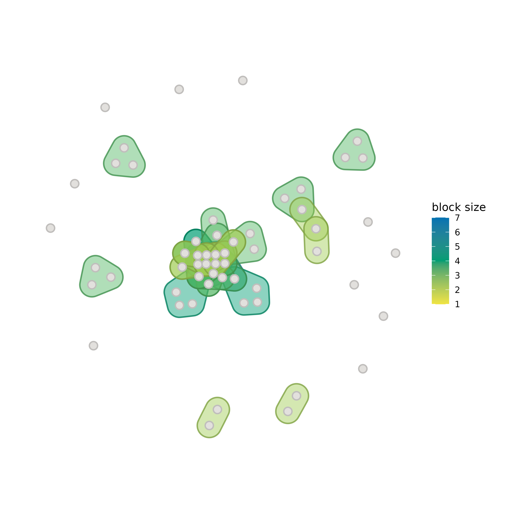

### Growth

[`hg_growth()`](https://mohsaqr.github.io/hypernets/reference/hg_growth.md)
counts, at every event time, the nodes and hyperedges present: the
hyperedges as they are, the distinct member sets, and the memberships.
With `mode = "cumulative"` every count is cumulative and a decision
enters at its own date, the paper’s growing citation network. The result
is a time series table whose `time` column is on the hypergraph’s clock,
days since the first decision; the plot method draws it on the calendar.

``` r

growth_blocks <- hg_growth(blocks, mode = "cumulative")
tail(growth_blocks, 3)
#>       time n_nodes n_edges n_edges_distinct n_memberships
#> 2024 25722    3615   46167            13505         77029
#> 2025 25748    3616   46173            13506         77051
#> 2026 25762    3618   46257            13539         77284
```

Its [`plot()`](https://rdrr.io/r/graphics/plot.default.html) method
draws each count against time, the paper’s Figure 4a.

``` r

plot(growth_blocks,
     columns = c("n_nodes", "n_edges", "n_edges_distinct", "n_memberships"))
```

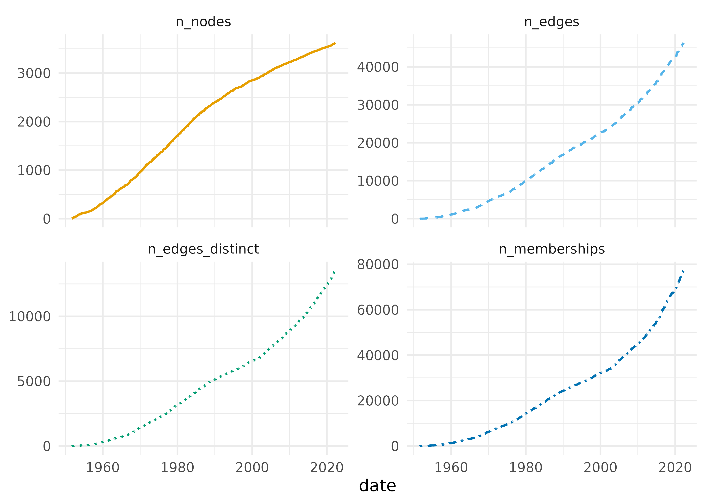

[`hg_edges()`](https://mohsaqr.github.io/hypernets/reference/hg_edges.md)
on a temporal hypergraph evaluates every snapshot requested with `at`
(dates are read on the hypergraph’s clock), and `what = "distribution"`
returns the empirical distribution of a hyperedge measure with its
complementary cumulative share, one block of rows per date. The
cumulative mode again gives the network as it stood on each date.

``` r

census_dates <- as.Date(c("1960-12-31", "1975-12-31", "1990-12-31",
                          "2005-12-31", "2020-12-31"))
sizes_by_date <- hg_edges(blocks, what = "distribution", at = census_dates,
                          snapshot_mode = "cumulative")
head(sizes_by_date)
#>   time value    n  proportion        ccdf
#> 1 3401     1 1121 0.853769992 1.000000000
#> 2 3401     2  120 0.091393755 0.146230008
#> 3 3401     3   39 0.029702970 0.054836253
#> 4 3401     4   21 0.015993907 0.025133283
#> 5 3401     5    6 0.004569688 0.009139375
#> 6 3401     6    2 0.001523229 0.004569688
```

Its [`plot()`](https://rdrr.io/r/graphics/plot.default.html) draws one
curve per date, the paper’s Figure 4b; the distribution shifts to the
right as blocks grow longer.

``` r

plot(sizes_by_date)
```

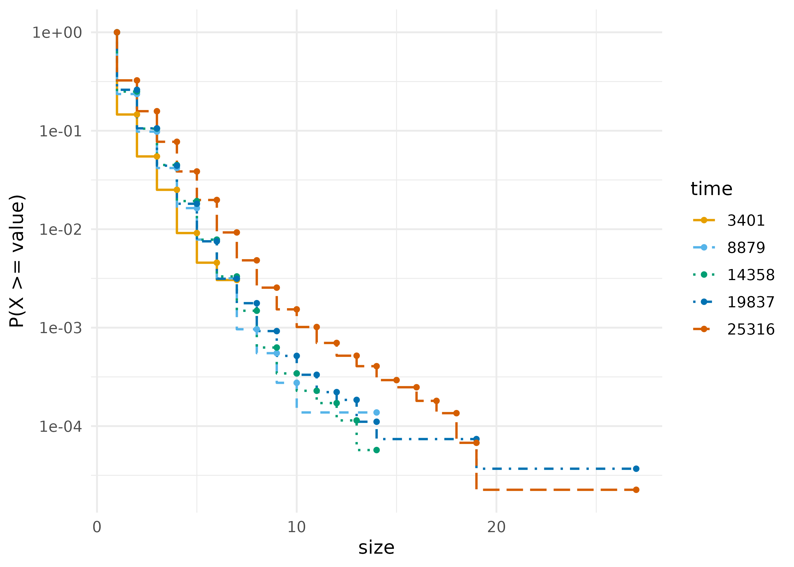

The `s` argument counts, for each hyperedge, the other hyperedges that
share at least `s` nodes with it. The paper’s Figure 4c draws that count
for `s = 2, 3, 4` on the multi-hypergraph.

``` r

intersections <- hg_edges(blocks_all, s = 2:4, what = "distribution",
                          measure = "n_incident_edges")
plot(intersections)
```

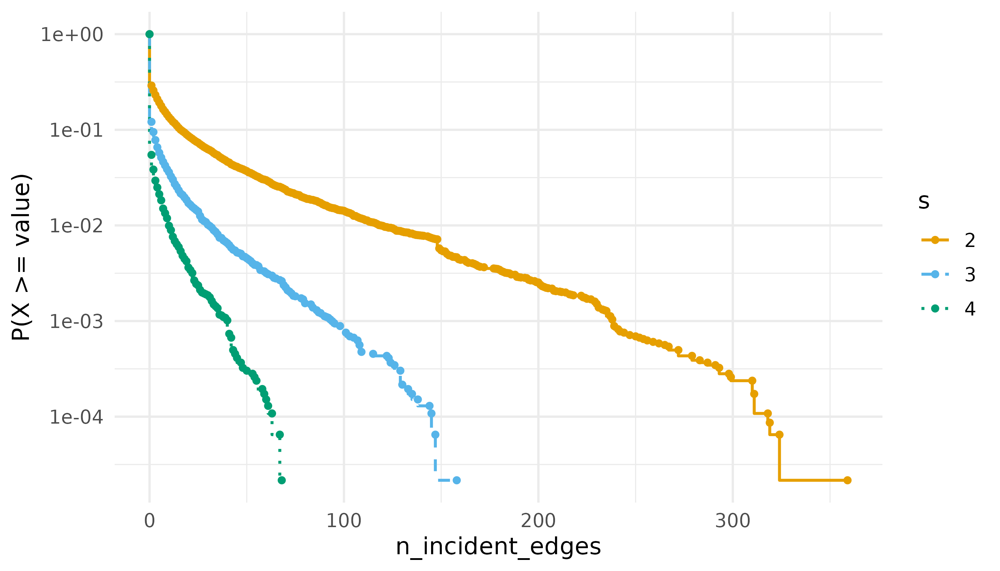

`multiedges = FALSE` in the snapshot collapses repeated member sets, the
binary hypergraph, on which the same counts are smaller.

``` r

blocks_binary <- hypergraph_snapshot(blocks, mode = "cumulative", multiedges = FALSE)
intersections_binary <- hg_edges(blocks_binary, s = 2:4, what = "distribution",
                                 measure = "n_incident_edges")
plot(intersections_binary)
```

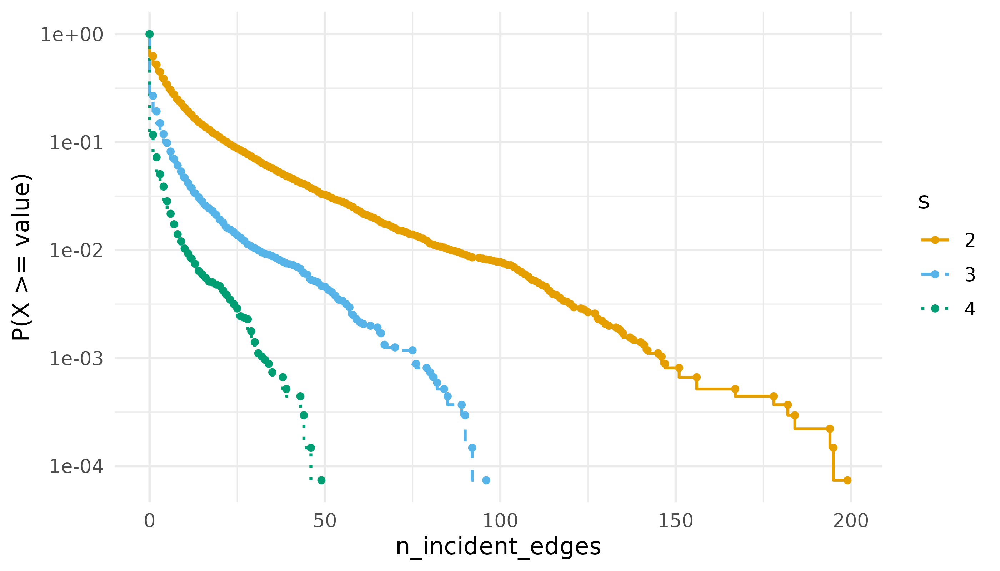

### Arbitrators and tribunals over time

[`hg_measures()`](https://mohsaqr.github.io/hypernets/reference/hg_measures.md)
with `what = "distribution"` gives the degree distributions of the
paper’s Figure 5a. The number of tribunals an arbitrator sits on is the
`hyperdegree`; one arbitrator, Brigitte Stern, sits on 94 tribunals and
accounts for the tail.

``` r

tribunal_counts <- hg_measures(tribunals_all, what = "distribution",
                               measure = "hyperdegree")
tail(tribunal_counts, 3)
#>    value n  proportion        ccdf
#> 33    43 1 0.002267574 0.006802721
#> 34    50 1 0.002267574 0.004535147
#> 35    94 1 0.002267574 0.002267574
plot(tribunal_counts)
```

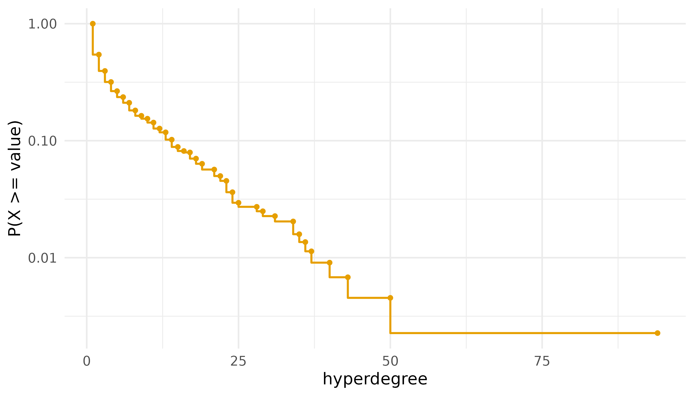

For interval data
[`hg_growth()`](https://mohsaqr.github.io/hypernets/reference/hg_growth.md)
reports the active counts and, in the `_cumulative` columns, the counts
of a static model that never retires a tribunal.

``` r

growth_tribunals <- hg_growth(tribunals)
tail(growth_tribunals, 3)
#>       time n_nodes n_edges n_edges_distinct n_memberships n_nodes_cumulative
#> 1074 17760     212     210              208           630                441
#> 1075 17777     212     209              207           627                441
#> 1076 17782     210     208              206           624                441
#>      n_edges_cumulative n_edges_distinct_cumulative
#> 1074                742                         722
#> 1075                742                         722
#> 1076                742                         722
```

The paper’s Figure 5b: cases grow about twice as fast as active cases,
and arbitrators about three times as fast as active arbitrators.

``` r

plot(growth_tribunals,
     columns = c("n_nodes", "n_edges", "n_nodes_cumulative", "n_edges_cumulative"),
     facets = FALSE)
```

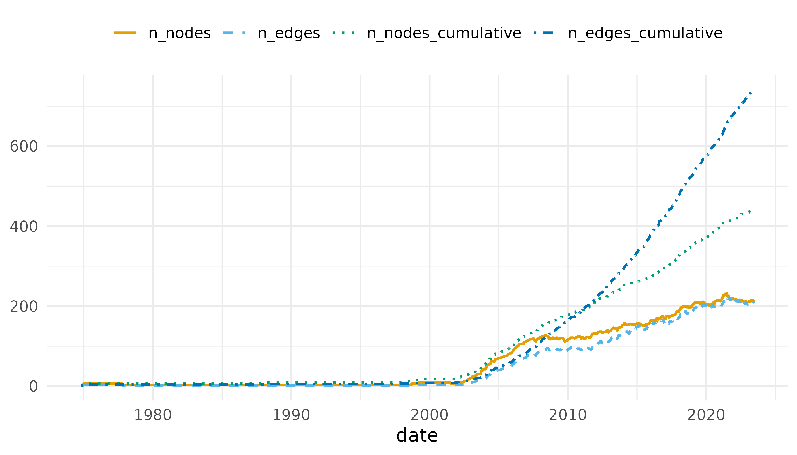

[`hg_edges()`](https://mohsaqr.github.io/hypernets/reference/hg_edges.md)
with `what = "summary"` returns, per snapshot, the mean and quartiles of
a hyperedge measure. The number of arbitrators within one hop of a
tribunal is `n_neighbors`.

``` r

neighbourhood <- hg_edges(tribunals, what = "summary", measure = "n_neighbors")
tail(neighbourhood, 3)
#>       time n_edges     mean       sd min q25 median q75 max
#> 1074 17760     210 24.60000 11.06449   0  17     24  32  54
#> 1075 17777     209 24.28230 10.81762   0  17     24  32  52
#> 1076 17782     208 24.26923 10.79920   0  17     24  32  52
```

The paper’s Figure 5c: the mean and median stay close together, unlike
the node degrees above.

``` r

plot(neighbourhood, columns = c("mean", "q25", "median", "q75"), facets = FALSE)
```

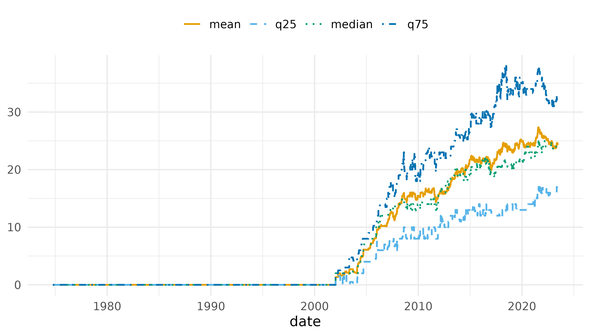

`components = TRUE` adds the connectivity of the active hypergraph at
each time: the number of components, the share of active arbitrators in
the largest, and its diameter. Since 2007 the largest component holds
more than 90 percent of the active arbitrators and its diameter stays
between 6 and 9, the observation the paper makes in prose.

``` r

connectivity <- hg_growth(tribunals, components = TRUE)
tail(connectivity, 3)
#>       time n_nodes n_edges n_edges_distinct n_memberships n_nodes_cumulative
#> 1074 17760     212     210              208           630                441
#> 1075 17777     212     209              207           627                441
#> 1076 17782     210     208              206           624                441
#>      n_edges_cumulative n_edges_distinct_cumulative n_components
#> 1074                742                         722            4
#> 1075                742                         722            4
#> 1076                742                         722            4
#>      largest_component diameter
#> 1074         0.9575472        7
#> 1075         0.9575472        7
#> 1076         0.9571429        7
```

### Repeated collaborations

[`hg_null_test()`](https://mohsaqr.github.io/hypernets/reference/hg_null_test.md)
compares a statistic with its distribution under a null that preserves
every node’s degree and every hyperedge’s size. The `repeated_edges`
statistic counts tribunals whose member set already occurred, the
paper’s repeated collaboration trios, and `repeated_pairs` the pairs of
arbitrators counted with multiplicity minus the distinct pairs, its
repeated collaboration pairs. `method = "assignment"` is the paper’s
null: arbitrators in decreasing degree each choose their cases without
replacement among the cases with a free seat. The 357 repeated pairs and
20 repeated trios lie far above the null (the paper reports z-scores of
4.81 and 10.40 from 1,000 draws).

``` r

hg_null_test(tribunals_all, statistic = c("repeated_pairs", "repeated_edges"),
             method = "assignment", n = 999, seed = 1)
#>        statistic observed  null_mean null_lo null_hi         z p_value   n
#> 1 repeated_pairs      357 299.438438     275     323  4.666061   0.001 999
#> 2 repeated_edges       20   2.612613       0       6 11.149553   0.001 999
#>       method
#> 1 assignment
#> 2 assignment
```

## Methods

### Hyperedge centralities

The centrality analysis of the paper runs on the tribunals active on the
last observed date.
[`hypergraph_snapshot()`](https://mohsaqr.github.io/hypernets/reference/hypergraph_snapshot.md)
with `mode = "active"` returns them, and `multiedges = FALSE` collapses
two tribunals with the same three members into one hyperedge.

``` r

observation_date <- as.Date("2023-06-15")
active <- hypergraph_snapshot(tribunals, at = observation_date,
                              mode = "active", multiedges = FALSE)
active
#> Hypergraph: 208 nodes, 205 hyperedges
#> Size distribution:
#>   size_3   : 205
#> Source: group membership (member = member, group = edge)
```

[`hg_edge_centrality()`](https://mohsaqr.github.io/hypernets/reference/hg_edge_centrality.md)
builds the s-line graph, in which two hyperedges are adjacent when they
share at least `s` nodes, and computes shortest-path betweenness and
closeness of the hyperedges on it with the NetworkX normalisation the
paper uses. `top = 10` keeps the ten most central cases.

``` r

top_betweenness <- hg_edge_centrality(active, s = 1, measure = "betweenness",
                                      top = 10)
top_betweenness
#>         edge s     measure      value
#> 1  ARB/17/21 1 betweenness 0.02654013
#> 2  ARB/19/27 1 betweenness 0.02499207
#> 3  ARB/18/23 1 betweenness 0.02262065
#> 4  ARB/16/20 1 betweenness 0.02213551
#> 5  ARB/20/19 1 betweenness 0.02206388
#> 6  ARB/18/43 1 betweenness 0.02137011
#> 7   ARB/21/5 1 betweenness 0.02136420
#> 8  ARB/20/53 1 betweenness 0.01910242
#> 9  ARB/20/13 1 betweenness 0.01904040
#> 10 ARB/16/39 1 betweenness 0.01796559
```

[`hg_subset()`](https://mohsaqr.github.io/hypernets/reference/hg_subset.md)
takes that table and cuts the snapshot down to those cases.

``` r

central_tribunals <- hg_subset(active, edges = top_betweenness)
central_tribunals
#> Hypergraph: 16 nodes, 10 hyperedges
#> Size distribution:
#>   size_3   : 10
#> Source: group membership (member = member, group = edge)
```

[`plot()`](https://rdrr.io/r/graphics/plot.default.html) draws them
coloured by economic sector: the paper’s Figure 6a. The names are the
archive’s.

``` r

plot(central_tribunals, color_by = "economic_sector",
     legend_title = "economic sector", label_size = 2.8)
```

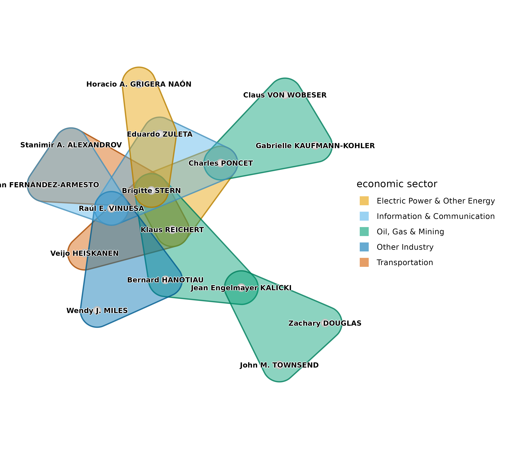

Closeness ranks a different set of tribunals (Figure 6b).

``` r

top_closeness <- hg_edge_centrality(active, s = 1, measure = "closeness",
                                    top = 10)
top_closeness
#>          edge s   measure     value
#> 1   ARB/18/23 1 closeness 0.4865949
#> 2   ARB/17/21 1 closeness 0.4772147
#> 3   ARB/20/19 1 closeness 0.4760676
#> 4   ARB/21/52 1 closeness 0.4715336
#> 5   ARB/16/39 1 closeness 0.4681894
#> 6    ARB/21/5 1 closeness 0.4616413
#> 7   ARB/22/20 1 closeness 0.4616413
#> 8   ARB/18/32 1 closeness 0.4605677
#> 9   ARB/19/27 1 closeness 0.4573767
#> 10 ADHOC/17/1 1 closeness 0.4552738
close_tribunals <- hg_subset(active, edges = top_closeness)
plot(close_tribunals, color_by = "economic_sector",
     legend_title = "economic sector", label_size = 2.8)
```

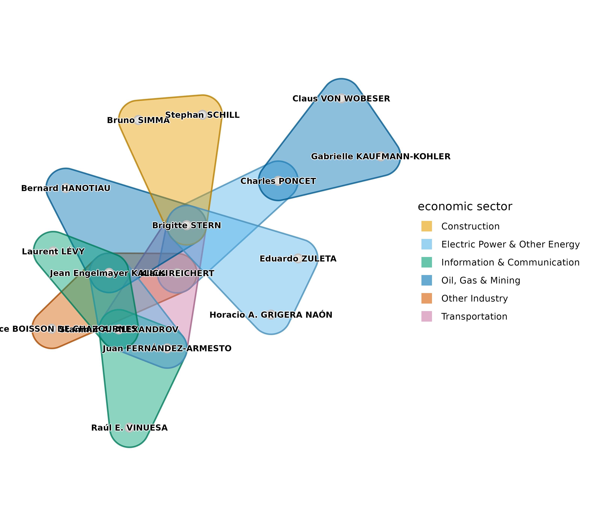

The static aggregate ranks tribunals that never overlapped in time. On
the seven most central cases by closeness in the aggregate,
`linetype_by` outlines the concluded cases differently from the pending
ones, the distinction the paper’s Figure 6d draws with dashed and solid
lines.

``` r

top_aggregate <- hg_edge_centrality(tribunals_all, s = 1, measure = "closeness",
                                    top = 7)
top_aggregate
#>        edge s   measure     value
#> 1  ARB/15/5 1 closeness 0.5456950
#> 2 ARB/17/21 1 closeness 0.5448794
#> 3  ARB/14/5 1 closeness 0.5424469
#> 4 ARB/10/21 1 closeness 0.5392371
#> 5 ARB/12/35 1 closeness 0.5388386
#> 6 ARB/10/20 1 closeness 0.5376464
#> 7 ARB/15/32 1 closeness 0.5372502
aggregate_tribunals <- hg_subset(tribunals_all, edges = top_aggregate)
plot(aggregate_tribunals, color_by = "economic_sector", linetype_by = "is_concluded",
     legend_title = "economic sector", label_size = 2.8)
```

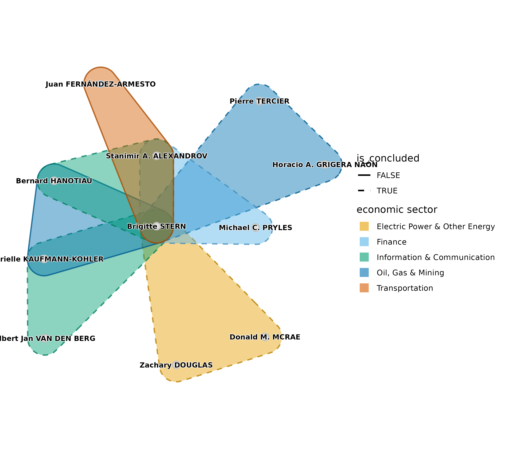

The paper’s Figure 6c ranks the edges of the temporal graph by ordinary
edge betweenness; that is a graph computation on the clique projection,
`hg_project(active, method = "clique")`, and is left to a graph engine.

### Motifs

[`hg_motifs()`](https://mohsaqr.github.io/hypernets/reference/hg_motifs.md)
counts the three induced four-node motifs of a 3-uniform hypergraph, Y
(two of the four possible triples), T (three) and O (all four), and
draws configuration-model null hypergraphs by the pairwise reshuffle of
HypergraphX, preserving degrees and cardinalities. The result holds the
observed count, the null mean and standard deviation, a z-score and an
empirical p-value per motif. On the aggregate hypergraph the Y motif
occurs 478 times against a null mean near 290, and the T motif 7 times
where the null almost never produces one; the O motif never occurs. The
paper uses 1,000 draws; 300 are used here.

``` r

motifs_aggregate <- hg_motifs(tribunals_all, n = 300, seed = 1)
motifs_aggregate
#>   motif observed   null_mean    null_sd        z     p_value     delta
#> 1     Y      478 291.6066667 20.3490857 9.159789 0.003322259 0.2409407
#> 2     T        7   0.7033333  0.8095197 7.778274 0.003322259 0.5380234
#> 3     O        0   0.0000000  0.0000000       NA 1.000000000 0.0000000
#>   normalized_delta   n             method
#> 1        0.4087138 300 configuration_mcmc
#> 2        0.9126626 300 configuration_mcmc
#> 3        0.0000000 300 configuration_mcmc
```

[`plot()`](https://rdrr.io/r/graphics/plot.default.html) draws the null
distribution with the observed count: the paper’s Figure 7c.

``` r

plot(motifs_aggregate)
```

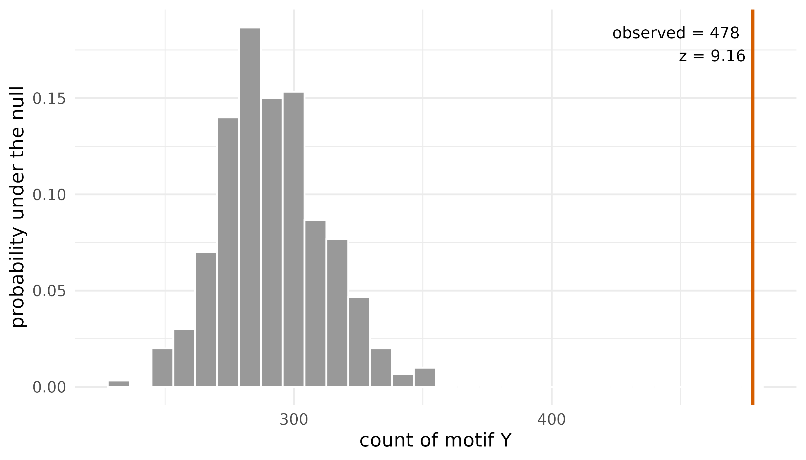

The last snapshot of the temporal hypergraph has far fewer Y motifs, 48,
and a smaller but still clear excess over its null (Figure 7b).

``` r

motifs_active <- hg_motifs(active, n = 300, seed = 1)
motifs_active
#>   motif observed   null_mean   null_sd          z     p_value        delta
#> 1     Y       48 25.33000000 5.2543093  4.3145537 0.003322259  0.293159188
#> 2     T        0  0.01333333 0.1146977 -0.1162476 1.000000000 -0.003322259
#> 3     O        0  0.00000000 0.0000000         NA 1.000000000  0.000000000
#>   normalized_delta   n             method
#> 1       0.99993579 300 configuration_mcmc
#> 2      -0.01133188 300 configuration_mcmc
#> 3       0.00000000 300 configuration_mcmc
plot(motifs_active)
```

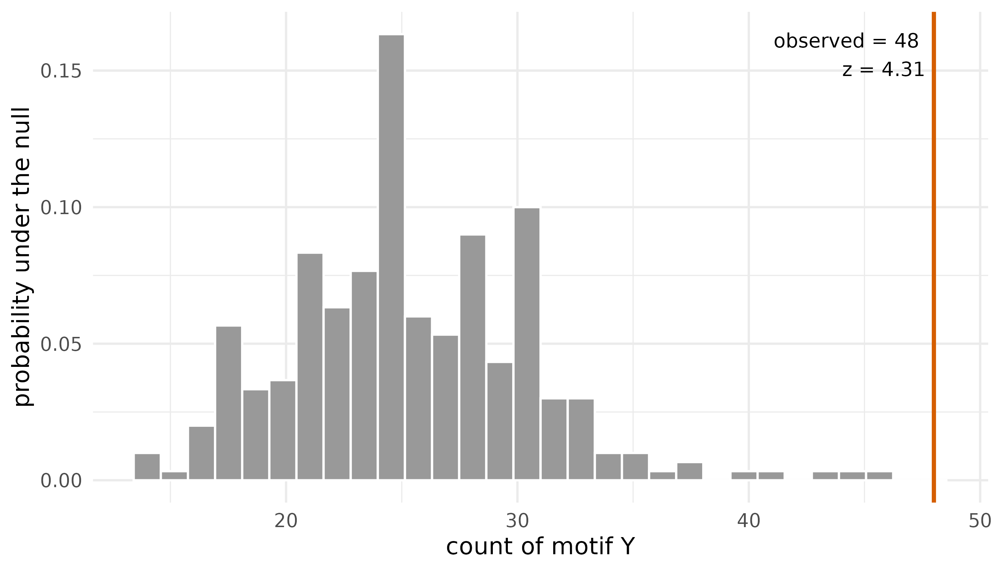

### Communities across representations

The paper clusters the GFCC data eight ways. Four representations are
hypergraph-derived: the association graph of
[`hg_project()`](https://mohsaqr.github.io/hypernets/reference/hg_project.md),
in which a block of size \|e\| gives each of its member pairs the weight
1 / (\|e\| - 1), on the binary (`bh`) or multi (`mh`) hypergraph, with
(`bhs`, `mhs`) or without self-association, the term that joins the
citing decision to the decisions it cites. Four are classic: the
citation graph, binary (`bg`) or multi (`mg`), directed or undirected
(`bgu`, `mgu`). The clustering uses backward citations only, those whose
citing decision is later than the cited one, so the temporal hypergraph
is rebuilt from that subset of the citation table.

``` r

backward_citations <- subset(gfcc_citations, date_citing > date_cited)
backward <- temporal_hypergraph(
  backward_citations, actor = "cited", group = "block",
  time = "date_citing", nodes = gfcc_decisions, sparse = TRUE
)
backward_all <- hypergraph_snapshot(backward, mode = "cumulative")
backward_all
#> Hypergraph: 3618 nodes, 46165 hyperedges
#> Size distribution:
#>   size_1   : 30795
#>   size_2   : 7759
#>   size_3   : 3787
#>   size_4   : 1880
#>   size_5   : 922
#>   size_6   : 513
#>   size_7   : 220
#>   size_8   : 130
#>   size_9   : 61
#>   size_10  : 35
#>   size_11  : 26
#>   size_12  : 12
#>   size_13  : 6
#>   size_14  : 5
#>   size_15  : 2
#>   size_16  : 3
#>   size_17  : 3
#>   size_18  : 3
#>   size_19  : 2
#>   size_27  : 1
#> Source: group membership (member = member, group = edge)
```

[`hg_communities()`](https://mohsaqr.github.io/hypernets/reference/hg_communities.md)
runs Infomap repeatedly on the chosen projection, compares every pair of
partitions with adjusted mutual information and keeps the run with the
largest summed AMI as the medoid. The paper uses 50 seeds with 100
trials each; five seeds with five trials are used here to keep the
vignette quick. The eight calls differ only in the projection they ask
for.

``` r

communities_bg <- hg_communities(backward_all, n_runs = 5, trials = 5,
                                 method = "citation", edge_source = "citing",
                                 duplicate_edges = "collapse", directed = TRUE)
communities_bgu <- hg_communities(backward_all, n_runs = 5, trials = 5,
                                  method = "citation", edge_source = "citing",
                                  duplicate_edges = "collapse")
communities_mg <- hg_communities(backward_all, n_runs = 5, trials = 5,
                                 method = "citation", edge_source = "citing",
                                 directed = TRUE)
communities_mgu <- hg_communities(backward_all, n_runs = 5, trials = 5,
                                  method = "citation", edge_source = "citing")
communities_bh <- hg_communities(backward_all, n_runs = 5, trials = 5,
                                 duplicate_edges = "collapse")
communities_bhs <- hg_communities(backward_all, n_runs = 5, trials = 5,
                                  duplicate_edges = "collapse",
                                  self_association = TRUE, edge_source = "citing")
communities_mh <- hg_communities(backward_all, n_runs = 5, trials = 5)
communities_mhs <- hg_communities(backward_all, n_runs = 5, trials = 5,
                                  self_association = TRUE, edge_source = "citing")
communities_mhs
#> Hypergraph Infomap ensemble: 3618 nodes, 5 runs
#> AMI medoid: run 2 (seed 2), 450 communities
```

[`hg_compare_communities()`](https://mohsaqr.github.io/hypernets/reference/hg_compare_communities.md)
sets the fits side by side. With the hypergraph passed as `hg`, every
medoid is also scored on its own projection. The summary counts the
communities, singletons and the balance between the two largest clusters
of each medoid. The association graphs without self-association leave
hundreds of uncited decisions as singletons; with self-association those
decisions join the clusters of the decisions they cite, and the largest
clusters stay balanced.

``` r

comparison <- hg_compare_communities(
  bg = communities_bg, bgu = communities_bgu, mg = communities_mg,
  mgu = communities_mgu, bh = communities_bh, bhs = communities_bhs,
  mh = communities_mh, mhs = communities_mhs, hg = backward_all,
  edge_source = "citing"
)
comparison
#> Community comparison across 8 representations: bg, bgu, mg, mgu, bh, bhs, mh, mhs
#>  model medoid_seed n_runs n_communities n_singletons n_nontrivial largest
#>     bg           1      5           362          221          141     284
#>    bgu           1      5           330          216          114     363
#>     mg           2      5           416          229          187      96
#>    mgu           5      5           404          216          188     132
#>     bh           2      5           874          664          210     120
#>    bhs           5      5           421          216          205     101
#>     mh           4      5           902          664          238      63
#>    mhs           2      5           450          216          234     102
#>  second   balance
#>     135 0.4753521
#>     190 0.5234160
#>      94 0.9791667
#>      92 0.6969697
#>      91 0.7583333
#>      89 0.8811881
#>      62 0.9841270
#>      87 0.8529412
```

[`plot()`](https://rdrr.io/r/graphics/plot.default.html) draws the
cluster-size distributions, the paper’s Figure 8b.

``` r

plot(comparison)
```

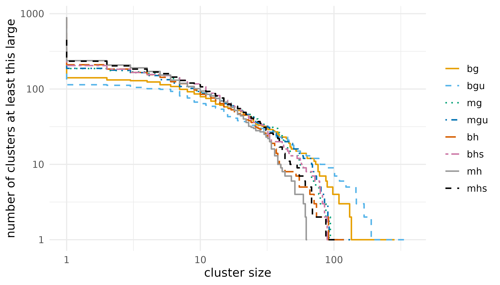

The similarity table holds the AMI, ARI and NMI between every pair of
medoids.

``` r

similarity <- as.data.frame(comparison, what = "similarity")
head(similarity)
#>   model_a model_b n_nodes       ami       ari       nmi
#> 1      bg     bgu    3618 0.6145999 0.4264076 0.7363186
#> 2      bg      mg    3618 0.6701875 0.4294139 0.7969289
#> 3      bg     mgu    3618 0.5943063 0.3773468 0.7469767
#> 4      bg      bh    3618 0.4515834 0.2696700 0.7035163
#> 5      bg     bhs    3618 0.5512366 0.3382037 0.7261486
#> 6      bg      mh    3618 0.4247086 0.2062517 0.6971605
```

`plot(what = "similarity")` is the paper’s Figure 8c with AMI below and
ARI above the diagonal. Clusterings of hypergraph-derived
representations agree more with each other than with those of the
classic graphs.

``` r

plot(comparison, what = "similarity")
```

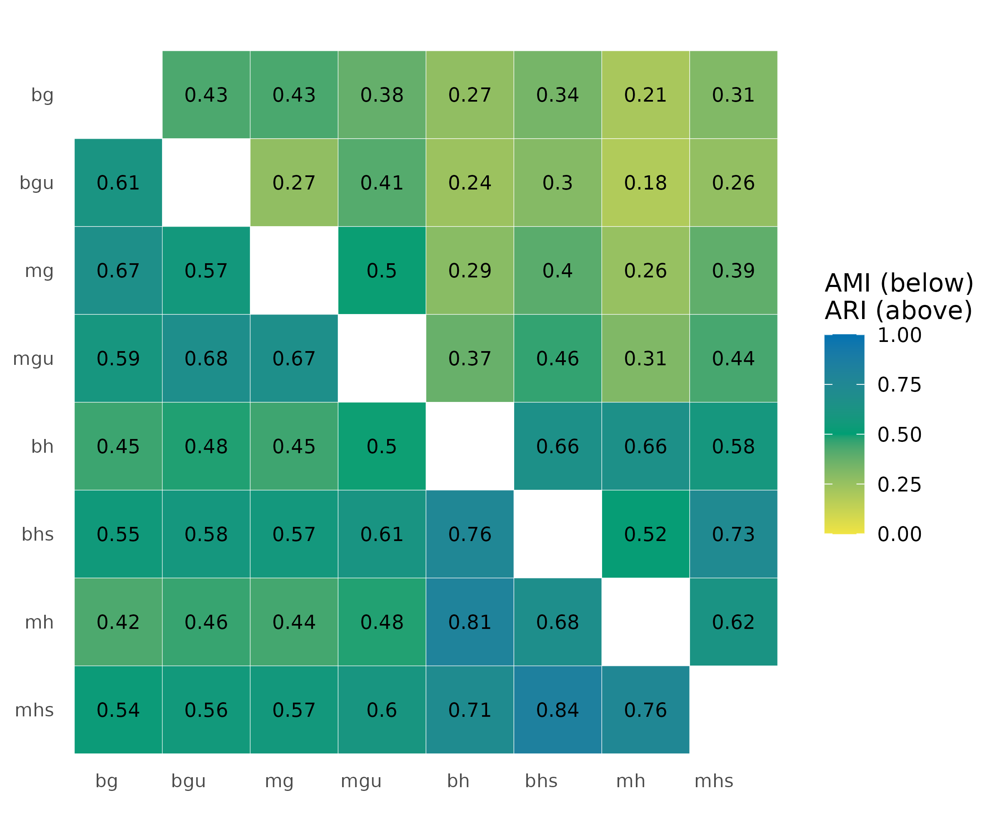

The quality table holds the graph-partition diagnostics of the paper for
each medoid on its own projection: coverage, weighted coverage,
performance, modularity, and the worst community conductance.

``` r

quality <- as.data.frame(comparison, what = "quality")
quality
#>   model  coverage weighted_coverage performance modularity conductance
#> 1    bg 0.3889722         0.3889722   0.9805861  0.3523059   1.0000000
#> 2   bgu 0.4713374         0.4713374   0.9725865  0.4197613   0.8881988
#> 3    mg 0.3087170         0.4933214   0.9882521  0.4716520   1.0000000
#> 4   mgu 0.3582378         0.5497558   0.9874580  0.5251639   0.8372881
#> 5    bh 0.4344190         0.5914135   0.9924775  0.5680416   0.7711864
#> 6   bhs 0.3167942         0.5720922   0.9879647  0.5521826   0.8374632
#> 7    mh 0.3769212         0.6147573   0.9937396  0.5950959   0.8333333
#> 8   mhs 0.2904028         0.6090068   0.9887366  0.5882855   0.8590284
#>   n_communities
#> 1           362
#> 2           330
#> 3           416
#> 4           404
#> 5           874
#> 6           421
#> 7           902
#> 8           450
```

## What the reproduction covers

Every figure and table of the paper that concerns the hypergraphs is
produced above from the released data: Table 1 by
[`summary()`](https://rdrr.io/r/base/summary.html), Table 2 by
[`hg_representations()`](https://mohsaqr.github.io/hypernets/reference/hg_representations.md),
Figure 3 by
[`hg_subset()`](https://mohsaqr.github.io/hypernets/reference/hg_subset.md)
and [`plot()`](https://rdrr.io/r/graphics/plot.default.html), Figures 4
and 5 by
[`hg_growth()`](https://mohsaqr.github.io/hypernets/reference/hg_growth.md),
[`hg_edges()`](https://mohsaqr.github.io/hypernets/reference/hg_edges.md)
and
[`hg_measures()`](https://mohsaqr.github.io/hypernets/reference/hg_measures.md),
Figure 6 by
[`hg_edge_centrality()`](https://mohsaqr.github.io/hypernets/reference/hg_edge_centrality.md),
Figure 7 by
[`hg_motifs()`](https://mohsaqr.github.io/hypernets/reference/hg_motifs.md),
Figure 8 by
[`hg_communities()`](https://mohsaqr.github.io/hypernets/reference/hg_communities.md)
and
[`hg_compare_communities()`](https://mohsaqr.github.io/hypernets/reference/hg_compare_communities.md),
and the repeated collaboration test by
[`hg_null_test()`](https://mohsaqr.github.io/hypernets/reference/hg_null_test.md).
The full-data runner `benchmarks/run_legal_hypergraphs_reproduction.R`
checks the association graphs, the archived medoids and the Figure 6
centralities against the authors’ archived results to numerical
tolerance: the active betweenness ranking is led by ARB/17/21 at
0.02654013 and the aggregate closeness ranking by ARB/15/5 at
0.54805703, and the motif census of the aggregate is Y = 478, T = 7, O =
0.

## References

Coupette, C., Hartung, D., and Katz, D. M. (2024). Legal hypergraphs.
Philosophical Transactions of the Royal Society A, 382(2270), 20230141.

Coupette, C., Hartung, D., and Katz, D. M. (2024). Legal hypergraphs
(Software). Zenodo, record 8081507.

Lotito, Q. F., Contisciani, M., De Bacco, C., Di Gaetano, L., Gallo, L.,
Montresor, A., Musciotto, F., Ruggeri, N., and Battiston, F. (2023).
Hypergraphx: a library for higher-order network analysis. Journal of
Complex Networks, 11(3), cnad019.

Rosvall, M., and Bergstrom, C. T. (2008). Maps of random walks on
complex networks reveal community structure. Proceedings of the National
Academy of Sciences, 105(4), 1118-1123.
