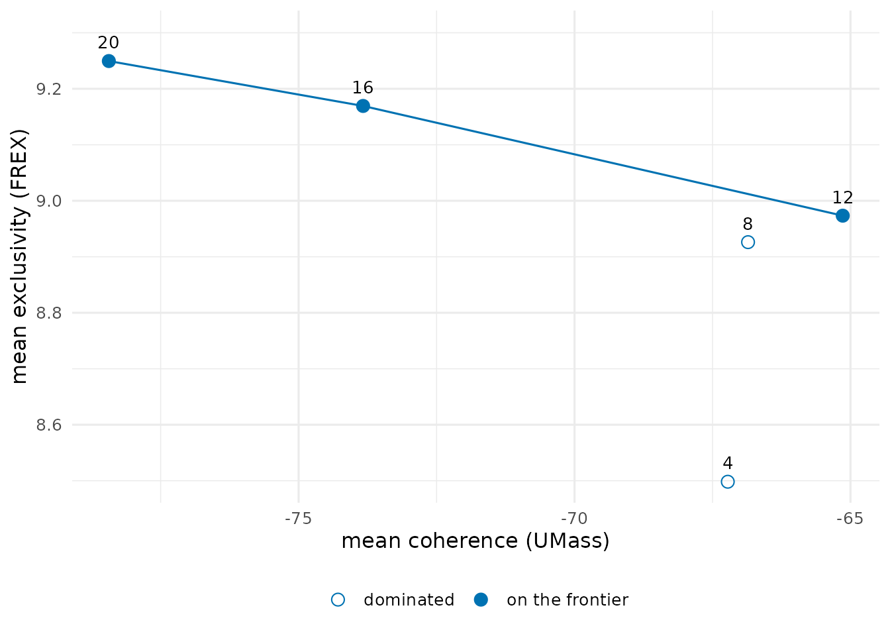
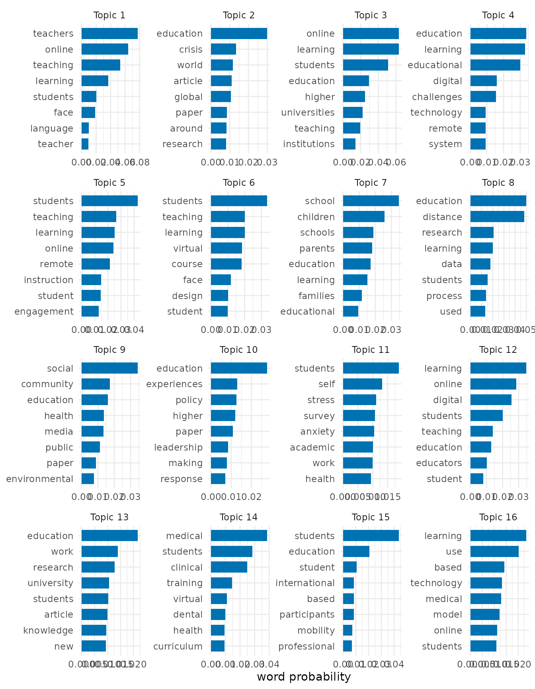
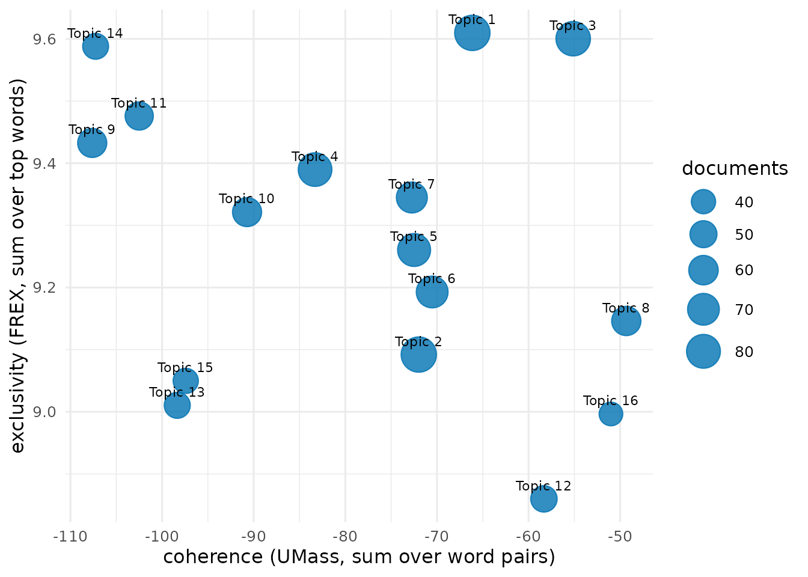

# Mixed-membership topics of the COVID-19 education literature

A topic model describes a corpus by a small number of themes. Each
theme, or topic, is a probability distribution over the words of the
vocabulary, and each document is a mixture of topics in proportions of
its own. An abstract on the online teaching of medical students draws on
a topic about online teaching and on a topic about medical education,
and it belongs to both in the proportions its words indicate. A
partition, in which every document belongs to exactly one topic, is the
special case of documents that are each about one thing. The shares of a
mixed-membership model show how close a corpus comes to that case.

## The corpus

`covid_sample` holds a random sample of 1,000 abstracts of research on
COVID-19 and education published from 2020 to 2024.
[`clean_text()`](https://mohsaqr.github.io/hypernets/reference/clean_text.md)
removes what a bibliographic export adds to an abstract, such as HTML,
citation numbers in brackets, URLs and copyright notices. The stop list
is
[`stop_words_en()`](https://mohsaqr.github.io/hypernets/reference/stop_words_en.md)
together with the words that name the subject of every abstract, since a
word that occurs in every document separates none of them.

``` r

abstracts <- clean_text(covid_sample, column = "abstract")
boilerplate <- c("covid", "coronavirus", "sars", "cov", "pandemic",
                 "disease", "study", "studies", "result", "results",
                 "conclusion", "conclusions", "background", "method",
                 "methods", "objective", "aim")
stops <- c(stop_words_en(), boilerplate)
```

## The hypergraph

Each abstract is a node, and each word that occurs at least five times
in the corpus is a hyperedge that binds the abstracts using it. The
incidence of an abstract and a word is the count of the word in the
abstract. The incidence matrix is stored dense (`sparse = FALSE`), which
the graded memberships at the end require.

``` r

abstracts_hg <- text_hypergraph(abstracts, column = "abstract", id = "doc",
                                stop_words = stops, min_count = 5,
                                min_chars = 2, sparse = FALSE)
abstracts_hg
#> Text hypergraph: 1000 documents, 3207 words (documents as nodes, weight = n)
#> Hyperedges: 3207 (words); sizes 1-688, median 10
#>                 doc       word count weight
#>  2-s2.0-85082857029   addition     1      1
#>  2-s2.0-85082857029   although     1      1
#>  2-s2.0-85082857029    attempt     1      1
#>  2-s2.0-85082857029      basic     1      1
#>  2-s2.0-85082857029 beneficial     1      1
#>  2-s2.0-85082857029     bridge     1      1
#>  2-s2.0-85082857029       care     1      1
#>  2-s2.0-85082857029    centers     1      1
#>  2-s2.0-85082857029  challenge     1      1
#>  2-s2.0-85082857029    changes     1      1
#> ... 73212 more rows
```

The hypergraph has 1000 abstracts and 3,207 words.

## How many topics

A topic model has as many topics as it is given, and no statistic
identifies the correct number. Two properties of the topics guide the
choice. Semantic coherence measures how often the most probable words of
a topic occur in the same documents (Mimno et al. 2011). For every pair
of top words it takes the logarithm of the number of documents
containing both, plus one, divided by the number of documents containing
the more probable word, and it sums these values over the pairs. Values
closer to zero are more coherent. Exclusivity measures how far the top
words of a topic belong to that topic rather than to the others. FREX
combines, for every top word, the rank of its probability within the
topic and the rank of its share of the probability it has across all
topics, and sums these over the top words (Bischof & Airoldi 2012).
Models with fewer topics have broader, more coherent topics, and models
with more topics have narrower, more exclusive ones. A number of topics
is worth considering when no other number gives both a higher coherence
and a higher exclusivity, and these numbers form the frontier of the two
measures (Roberts et al. 2014).

[`hg_topic_search()`](https://mohsaqr.github.io/hypernets/reference/hg_topic_search.md)
fits the topic model of the next section for 4, 8, 12, 16 and 20 topics,
each from two random starts, and reports the mean coherence and the mean
exclusivity of the ten most probable words of the topics.

``` r

topic_search <- hg_topic_search(abstracts_hg, k = seq(4, 20, by = 4),
                                nstart = 2, parallel = TRUE, n_cores = 2)
topic_search
#>    k coherence exclusivity divergence agreement converged frontier
#> 1  4 -67.22319    8.498221   273297.4 0.6321988      TRUE    FALSE
#> 2  8 -66.85606    8.926085   258437.1 0.5453186      TRUE    FALSE
#> 3 12 -65.14011    8.973373   249732.6 0.4432424      TRUE     TRUE
#> 4 16 -73.83179    9.169332   242523.0 0.4001491      TRUE     TRUE
#> 5 20 -78.43863    9.249530   236057.8 0.3952962      TRUE     TRUE
```

``` r

plot(topic_search)
```



Mean coherence falls from -67.2 with 4 topics to -73.8 with 16 and -78.4
with 20, and mean exclusivity rises from 8.5 to 9.17 and 9.25. The
models with 12, 16 and 20 topics lie on the frontier. Sixteen topics is
the number of the published structural topic model of this literature
(Saqr et al. 2023), and the model below uses it.

## A mixed-membership model of 16 topics

[`hg_topics()`](https://mohsaqr.github.io/hypernets/reference/hg_topics.md)
approximates the matrix of word counts, with one row per abstract and
one column per word, by the product of two non-negative matrices. The
first gives every abstract a weight on every topic, and the second gives
every topic a weight on every word. The fit minimises the
Kullback-Leibler divergence between the counts and their approximation
by the multiplicative updates of Lee and Seung (2001). With this
divergence the factorization is the maximum-likelihood fit of
probabilistic latent semantic analysis (Hofmann 1999; Gaussier & Goutte
2005). After normalisation, the weights of an abstract are its shares of
the topics, which sum to one, and the weights of a topic are the
probabilities of its words.

The fit depends on its random start. It is run from five starts, and the
start with the smallest divergence is kept. The agreement of a topic is
the average Jaccard coefficient of its first one, two, and up to ten
most probable words with those of the matching topic of another start,
the topics of two starts being paired by the Hungarian method (Kuhn
1955; Greene et al. 2014). A topic whose agreement is close to one is
found again from every start.

``` r

topic_model <- hg_topics(abstracts_hg, k = 16, nstart = 5, parallel = TRUE,
                         n_cores = 2)
topic_model
#> Topic model (KL factorization): 16 topics, 1000 documents, 3207 words; best of 5 starts (divergence 241720, converged)
#>     topic prevalence documents agreement
#>   Topic 1 0.08752438  87.52438 0.6941500
#>   Topic 2 0.08720875  87.20875 0.4538721
#>   Topic 3 0.08302419  83.02419 0.6403082
#>   Topic 4 0.07901333  79.01333 0.4395457
#>   Topic 5 0.07558374  75.58374 0.5107730
#>   Topic 6 0.07008201  70.08201 0.4917472
#>   Topic 7 0.06634116  66.34116 0.6253662
#>   Topic 8 0.05904374  59.04374 0.3730107
#>   Topic 9 0.05842773  58.42773 0.3084835
#>  Topic 10 0.05834905  58.34905 0.3185530
#>                                              top_words
#>         teachers, online, teaching, learning, students
#>              education, crisis, world, article, global
#>          online, learning, students, education, higher
#>  education, learning, educational, digital, challenges
#>           students, teaching, learning, online, remote
#>          students, teaching, learning, virtual, course
#>          school, children, schools, parents, education
#>          education, distance, research, learning, data
#>            social, community, education, health, media
#>          education, experiences, policy, higher, paper
#> ... 6 more rows
```

The prevalence of a topic is its mean share over the abstracts, and its
documents column is the sum of those shares, the expected number of
abstracts it accounts for. The largest topic, led by teachers, online,
teaching, learning, students, accounts for 8.8% of the corpus, and the
smallest, led by learning, use, based, technology, medical, for 3.8%.
The mean agreement of the topics across the starts is 0.44. Topics with
a low agreement are one of several divisions of their part of the
vocabulary that the data support about equally well.

``` r

plot(topic_model)
```



## How mixed the abstracts are

The largest share of an abstract identifies its main topic.

``` r

main_topics <- hg_get(topic_model, what = "documents")
head(main_topics)
#>                 node    topic     share
#> 1 2-s2.0-85082857029 Topic 14 0.4474206
#> 2 2-s2.0-85083678184  Topic 2 0.2732632
#> 3 2-s2.0-85085340620  Topic 2 0.3876842
#> 4 2-s2.0-85085481629  Topic 2 0.4634364
#> 5 2-s2.0-85085656133  Topic 7 0.3388212
#> 6 2-s2.0-85085770267  Topic 9 0.8825215
```

In the median abstract the main topic has a share of 0.53, and half the
abstracts lie between 0.4 and 0.71. 9.2% of the abstracts have a main
topic with a share of 0.9 or more, and 44.3% have no topic with a share
above one half. Most abstracts combine topics.

The shares of a single abstract show the mixture.

``` r

shares <- hg_get(topic_model, what = "shares")
example_shares <- subset(shares, node == "2-s2.0-85101300775" & share >= 0.05)
example_shares
#>                    node    topic     share
#> 3926 2-s2.0-85101300775  Topic 6 0.4169550
#> 3934 2-s2.0-85101300775 Topic 14 0.4318787
#> 3936 2-s2.0-85101300775 Topic 16 0.1289428
```

``` r

example_abstract <- subset(abstracts, doc == "2-s2.0-85101300775")
with(example_abstract, writeLines(strwrap(abstract, 78)))
#> As COVID- necessitated student removal from clinical environments, a virtual
#> curriculum involving existing and novel clerkship elements was developed that
#> utilized near peers for both teaching and feedback. Shelf scores, engagement,
#> and satisfaction demonstrated success of these new curricular elements, many
#> of which will be incorporated for future students.
```

The abstract describes near-peer teaching in a medical course moved
online. It takes a share of 0.43 of the topic led by medical, students,
clinical, training, virtual and 0.42 of the topic led by students,
teaching, learning, virtual, course. A partition would assign it to one
of the two and lose the other half of what it is about.

## Topic quality

[`hg_topic_quality()`](https://mohsaqr.github.io/hypernets/reference/hg_topic_quality.md)
scores every topic by the same coherence and exclusivity. The size of a
topic is its expected number of abstracts.

``` r

model_quality <- hg_topic_quality(abstracts_hg, topics = topic_model)
model_quality
#>       topic     size n_words  coherence exclusivity coherence_type
#> 1   Topic 1 87.52438      10  -66.13544    9.609738          umass
#> 2   Topic 2 87.20875      10  -71.98103    9.092124          umass
#> 3   Topic 3 83.02419      10  -55.13079    9.600369          umass
#> 4   Topic 4 79.01333      10  -83.30129    9.389781          umass
#> 5   Topic 5 75.58374      10  -72.49343    9.260411          umass
#> 6   Topic 6 70.08201      10  -70.51942    9.192791          umass
#> 7   Topic 7 66.34116      10  -72.73872    9.344828          umass
#> 8   Topic 8 59.04374      10  -49.33452    9.146173          umass
#> 9   Topic 9 58.42773      10 -107.62267    9.432636          umass
#> 10 Topic 10 58.34905      10  -90.72152    9.321368          umass
#> 11 Topic 11 54.74724      10 -102.49338    9.475982          umass
#> 12 Topic 12 47.78552      10  -58.32491    8.859948          umass
#> 13 Topic 13 46.24201      10  -98.34051    9.010448          umass
#> 14 Topic 14 45.78699      10 -107.25060    9.588114          umass
#> 15 Topic 15 43.33170      10  -97.41630    9.049778          umass
#> 16 Topic 16 37.50845      10  -51.01024    8.996497          umass
#>    exclusivity_type
#> 1              frex
#> 2              frex
#> 3              frex
#> 4              frex
#> 5              frex
#> 6              frex
#> 7              frex
#> 8              frex
#> 9              frex
#> 10             frex
#> 11             frex
#> 12             frex
#> 13             frex
#> 14             frex
#> 15             frex
#> 16             frex
```

``` r

plot(model_quality)
```



## A partition of the abstracts

A partition is appropriate when the abstracts are each about one topic.
It is useful when they have to be drawn or compared as groups, and the
hypergraph can then be divided directly.
[`hg_cluster()`](https://mohsaqr.github.io/hypernets/reference/hg_cluster.md)
places the abstracts by the eigenvectors of the 16 smallest eigenvalues
of the hypergraph Laplacian of Zhou et al. (2006) and divides them by
k-means.

``` r

clusters <- hg_cluster(abstracts_hg, k = 16, seed = 1)
cluster_quality <- hg_topic_quality(abstracts_hg, clusters = clusters)
cluster_quality
#>         topic size n_words coherence exclusivity coherence_type
#> 1   Cluster 1   43      10 -53.76285    8.488092          umass
#> 2   Cluster 2   86      10 -56.98734    8.238415          umass
#> 3   Cluster 3   61      10 -56.35060    7.666019          umass
#> 4   Cluster 4   46      10 -82.65985    8.189977          umass
#> 5   Cluster 5   47      10 -87.24374    8.760715          umass
#> 6   Cluster 6   77      10 -49.88350    8.606339          umass
#> 7   Cluster 7   64      10 -47.64373    7.452209          umass
#> 8   Cluster 8   76      10 -58.02618    7.526915          umass
#> 9   Cluster 9   59      10 -71.12633    8.644594          umass
#> 10 Cluster 10   87      10 -55.87994    8.640050          umass
#> 11 Cluster 11   32      10 -50.52326    8.163612          umass
#> 12 Cluster 12   35      10 -47.87456    8.621547          umass
#> 13 Cluster 13   84      10 -64.51622    8.489412          umass
#> 14 Cluster 14   78      10 -64.96824    8.617097          umass
#> 15 Cluster 15   49      10 -47.11714    8.488738          umass
#> 16 Cluster 16   76      10 -56.74517    8.090683          umass
#>    exclusivity_type
#> 1              frex
#> 2              frex
#> 3              frex
#> 4              frex
#> 5              frex
#> 6              frex
#> 7              frex
#> 8              frex
#> 9              frex
#> 10             frex
#> 11             frex
#> 12             frex
#> 13             frex
#> 14             frex
#> 15             frex
#> 16             frex
```

``` r

hg_agreement(clusters, main_topics, label = c("cluster", "topic"),
             method = c("ari", "nmi"))
#>      n agreement aligned       ari       nmi
#> 1 1000         0     347 0.1297581 0.2816076
```

The clusters have a mean coherence of -59.5 and a mean exclusivity of
8.29, against -78.4 and 9.27 for the topics of the mixed model, so the
clusters are more coherent and less exclusive. The adjusted Rand index
between the clusters and the main topics is 0.13. A partition has to
place every abstract that lies between topics on one side, and the two
divisions agree only in part.

The clustering can itself be given graded memberships. The symmetric
non-negative factorization of the similarity between abstracts that the
hypergraph Laplacian defines (Kuang et al. 2012; Hayashi et al. 2020)
gives every abstract a non-negative weight on every cluster, normalised
to sum to one. These memberships describe how strongly the position of
an abstract in the hypergraph loads on each cluster, and they do not
model its words.

``` r

cluster_membership <- hg_cluster(abstracts_hg, k = 16, algorithm = "symnmf",
                                 seed = 1, nstart = 5, what = "membership")
subset(cluster_membership, node == "2-s2.0-85101300775" & membership >= 0.05)
#>                    node    cluster membership
#> 3921 2-s2.0-85101300775  Cluster 1 0.43309197
#> 3922 2-s2.0-85101300775  Cluster 2 0.16387455
#> 3928 2-s2.0-85101300775  Cluster 8 0.08706796
#> 3929 2-s2.0-85101300775  Cluster 9 0.10006368
#> 3930 2-s2.0-85101300775 Cluster 10 0.06309764
#> 3933 2-s2.0-85101300775 Cluster 13 0.07978621
```

The main cluster of an abstract has a membership of 0.24 in the median
abstract, and 0.6% of the abstracts have a main cluster with a
membership of 0.9 or more. The graded memberships of the clustering also
place most abstracts between clusters.

## References

Bischof, J. M., & Airoldi, E. M. (2012). Summarizing topical content
with word frequency and exclusivity. *Proceedings of the 29th
International Conference on Machine Learning*, 201-208.

Gaussier, E., & Goutte, C. (2005). Relation between PLSA and NMF and
implications. *Proceedings of SIGIR 2005*, 601-602.
<https://doi.org/10.1145/1076034.1076148>

Greene, D., O’Callaghan, D., & Cunningham, P. (2014). How many topics?
Stability analysis for topic models. *Machine Learning and Knowledge
Discovery in Databases*, 498-513.
<https://doi.org/10.1007/978-3-662-44848-9_32>

Hayashi, K., Aksoy, S. G., Park, C. H., & Park, H. (2020). Hypergraph
random walks, Laplacians, and clustering. *Proceedings of CIKM 2020*,
495-504. <https://doi.org/10.1145/3340531.3412034>

Hofmann, T. (1999). Probabilistic latent semantic indexing. *Proceedings
of SIGIR 1999*, 50-57. <https://doi.org/10.1145/312624.312649>

Kuang, D., Ding, C., & Park, H. (2012). Symmetric nonnegative matrix
factorization for graph clustering. *Proceedings of the 2012 SIAM
International Conference on Data Mining*, 106-117.
<https://doi.org/10.1137/1.9781611972825.10>

Kuhn, H. W. (1955). The Hungarian method for the assignment problem.
*Naval Research Logistics Quarterly*, 2, 83-97.
<https://doi.org/10.1002/nav.3800020109>

Lee, D. D., & Seung, H. S. (2001). Algorithms for non-negative matrix
factorization. *Advances in Neural Information Processing Systems*, 13,
556-562.

Mimno, D., Wallach, H. M., Talley, E., Leenders, M., & McCallum, A.
(2011). Optimizing semantic coherence in topic models. *Proceedings of
EMNLP 2011*, 262-272.

Roberts, M. E., Stewart, B. M., Tingley, D., Lucas, C., Leder-Luis, J.,
Gadarian, S. K., Albertson, B., & Rand, D. G. (2014). Structural topic
models for open-ended survey responses. *American Journal of Political
Science*, 58(4), 1064-1082. <https://doi.org/10.1111/ajps.12103>

Saqr, M., Raspopovic Milic, M., Pancheva, K., Jovic, J., Peltekova, E.
V., & Conde, M. Á. (2023). A multimethod synthesis of Covid-19 education
research: The tightrope between covidization and meaningfulness.
*Universal Access in the Information Society*, 23(3), 1163-1176.
<https://doi.org/10.1007/s10209-023-00989-w>

Zhou, D., Huang, J., & Schölkopf, B. (2006). Learning with hypergraphs:
Clustering, classification, and embedding. *Advances in Neural
Information Processing Systems*, 19, 1601-1608.
